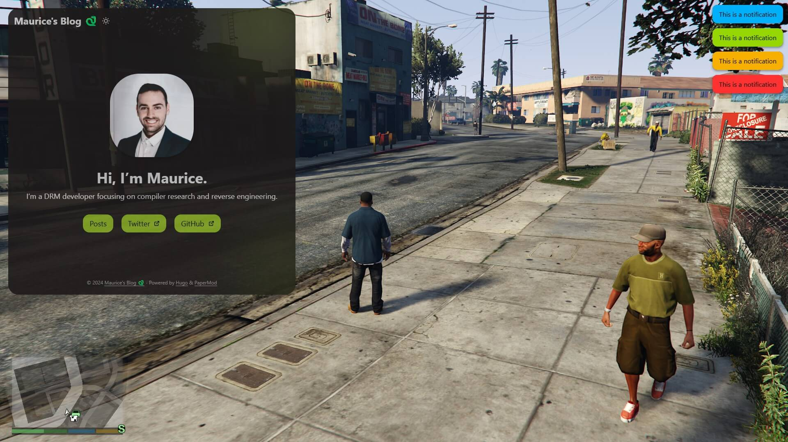

<h1 align="center">
	Game Overlay
	 
	
	
	
	
</h1>

This project aims to provide a customizable gameoverlay using <a href="https://bitbucket.org/chromiumembedded/cef">CEF</a>.  
It is still unfinished and in a very early state.  
Hooking and drawing using common backends is already working,  
just like rendering offscreen browsers with CEF.

## Supported Backends

| Engine     | x86 | x64 |
|:---------- |:---:|:---:|
| DirectX 8  | ✅ |   |
| DirectX 9  | ✅ | ✅ |
| DirectX 10 | ✅ | ✅ |
| DirectX 11 | ✅ | ✅ |
| DirectX 12 | ✅ | ✅ |
| OpenGL     | ✅ | ✅ |
| Vulkan     | ⛔ | ⛔ |

## Preview

